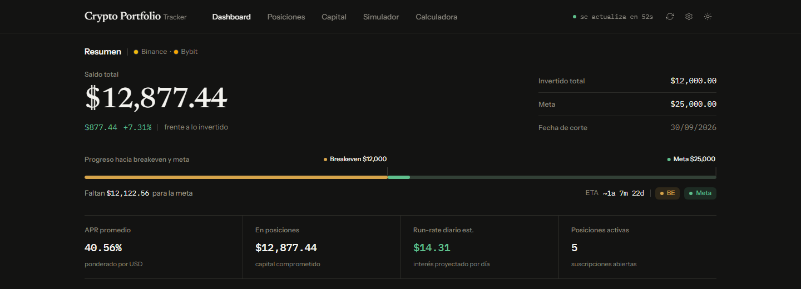

# Crypto Portfolio Tracker

> **Estado:** en desarrollo activo. La aplicacion local, el build y la suite automatizada son funcionales; las integraciones de exchange permanecen deliberadamente en modo de solo lectura.

App web estatica para monitorear un portfolio crypto, seguir las posiciones Dual Investment que reportan los exchanges conectados, proyectar recuperacion por compound y calcular rendimiento de swing trade.



La captura muestra el estado inicial de una instalacion limpia. El repositorio no incluye credenciales ni datos de cartera.

## Alcance

- Frontend: `Bun + TypeScript` con HTML imports.
- Servidor local Bun para assets, proxy de exchanges y vault DPAPI local en Windows.
- Dependencias gestionadas con `pnpm`.
- Persistencia local en `localStorage`.
- Tabla de proyeccion mensual en la vista `Simulador`.

## Documentacion tecnica

- Guia tecnica del repo: `ENGINEERING_GUIDE.md`
- Sistema visual y reglas de diseno: `docs/design-system.md`
- Riesgos vigentes de diseno: `design-audit-findings.md`

## Requisitos

- Bun 1.3+
- pnpm 11+
- Windows para guardar credenciales privadas en el vault DPAPI local. Sin DPAPI no se pueden guardar credenciales, y la app queda limitada a datos publicos de mercado: sin credenciales no hay posiciones ni saldos que mostrar.
- Python 3 solo para `pnpm run eth:analysis`.

## Inicio rapido

```bash
pnpm install
pnpm run dev
```

Abrir la URL local que imprime Bun (por defecto `http://localhost:5176`).

## Scripts

| Comando                  | Descripcion                  |
| ------------------------ | ---------------------------- |
| `pnpm run dev`           | Desarrollo con hot reload    |
| `pnpm run build`         | Build de produccion Bun      |
| `pnpm run preview`       | Servir build local           |
| `pnpm run test`          | Tests en modo watch          |
| `pnpm run test:run`      | Tests una sola vez           |
| `pnpm run test:coverage` | Tests + reporte de coverage  |
| `pnpm run typecheck`     | Validacion TypeScript        |
| `pnpm run lint`          | Lint con ESLint              |
| `pnpm run lint:fix`      | Lint + autofix               |
| `pnpm run format`        | Formatear con Prettier       |
| `pnpm run format:check`  | Verificar formato            |
| `pnpm run eth:analysis`  | Ejecutar analisis ETH Python |
| `pnpm run check`         | Typecheck + coverage + build |
| `pnpm run check:ci`      | Alias CI de `check`          |

## Flujo recomendado de uso

1. Abrir `Configuracion` desde el engrane del shell y conectar Binance o Bybit con claves de solo lectura.
2. Definir en el mismo modal el invertido total y la meta; el saldo y las posiciones los aportan los exchanges.
3. Sincronizar desde el shell y revisar `Dashboard` y `Posiciones`.
4. Revisar proyecciones en `Simulador` (AUTO o MANUAL) y evaluar ciclos en `Calculadora Swing Trade`.

## Vistas y comportamiento

### 1) Dashboard

- Resumen de portfolio: balance, P&L, progreso a breakeven (BE) y meta.
- La configuracion de invertido y meta vive en el modal global `Configuracion`; el saldo se deriva de posiciones y saldos de exchange.
- Barra de progreso con leyenda BE/Meta; el estado de la leyenda se persiste.
- Tarjetas de capital/APR/rendimiento diario calculadas desde posiciones y precios de mercado.
- Con credenciales configuradas, muestra saldos por activo reportados por los exchanges.
- Sin resumen de saldos de exchange y sin posiciones, conserva el ultimo saldo guardado en vez de reescribirlo a cero.

### 2) Posiciones

- Vista de solo lectura: las posiciones Dual Investment llegan sincronizadas desde Binance y Bybit.
- Sin exchanges conectados el estado vacio pide configurar credenciales; con exchanges conectados invita a sincronizar.
- **Tira de precios spot**: muestra precio actual y cambio 24h de los activos con posiciones (BTC, ETH, BNB, SOL). Orden fijo, excluye stablecoins.
- La sincronizacion reemplaza la lista completa; no hay alta, edicion ni borrado de posiciones desde la UI.

### 3) Simulador

- Proyeccion de compound con frecuencia `Diaria`, `Semanal` o `Quincenal`.
- Modos `AUTO/MANUAL` para:
  - Capital (AUTO: total en posiciones).
  - APR (AUTO: promedio ponderado USD de posiciones).
  - Meta (AUTO: meta del dashboard).
- Boton `Resetear AUTO` para restaurar sincronizacion automatica.
- Resultado con hitos de BE/meta y tabla de proyeccion mensual.
- Arquitectura interna refactorizada en `constants`, `template`, `dom` y `state`.

### 4) Calculadora Swing Trade

- Evalua resultados reales y estrategia objetivo por ciclo.
- Soporta tabla de compras parciales (`Agregar`/`Borrar`).
- Cuando hay compras validas:
  - Capital y precio base se bloquean en modo AUTO usando totales de compras.
- Presets de fee: `spot` y `futures` (con switch FDUSD en spot).
- Arquitectura interna refactorizada para separar copy/presets y template del flujo de calculo.

## Arquitectura UI

- Shell compartido extraido para header, navegacion y acciones globales.
- Sistema visual consolidado alrededor de `src/styles/variables.css` y `src/utils/theme.ts`.
- `dashboard`, `simulator` y `calculadora` siguen un patron modular; `positions` ya extrae constants/template/table, pero conserva logica de coordinacion en `positions.ts`.
- Los colores de browser theme se derivan de tokens CSS para evitar drift entre tema y runtime.

## Datos de mercado

- Endpoints publicos Binance usados por defecto (con fallback):
  - `https://api.binance.com/api/v3/ticker/price`
  - `https://api.binance.us/api/v3/ticker/price`
- Para cambio 24h se deriva el endpoint `/ticker/24hr`.
- `PUBLIC_BINANCE_ENDPOINTS` puede reemplazar la lista de endpoints publicos en builds locales.
- Estrategia de precio:
  - Par directo `ASSETUSDT`.
  - Fallback via `ASSETBTC` x `BTCUSDT`.
- Polling central: cada 60s (`MARKET_POLL_INTERVAL_MS = 60000`).
- Cache en memoria de precios: TTL 60s.
- Si no hay precio fresco:
  - Usa `cache-stale` cuando exista cache anterior.
  - Marca `unavailable` cuando no hay forma de resolver precio.
- Ante fallo/parcialidad:
  - Se registra estado de error de API.
  - Se muestra banner `No se pudo actualizar precios de mercado`.
  - El header pasa a estado de error con ultimo dato valido relativo.

## Integraciones de exchange

- Binance usa endpoints firmados `GET` para lectura de cuenta y posiciones.
- La prueba de credenciales Binance valida `GET /sapi/v1/account/apiRestrictions` para detectar permisos de ejecucion, retiro o transferencia.
- Bybit V5 esta preparado con cliente separado y whitelist de endpoints `GET`:
  - `GET /v5/user/query-api` para confirmar `readOnly: 1`.
  - `GET /v5/account/wallet-balance` para saldos `UNIFIED`, `CONTRACT` y `SPOT`.
  - `GET /v5/asset/transfer/query-account-coins-balance` como respaldo de saldos con permisos de Activos.
  - `GET /v5/earn/advance/position` para posiciones activas de Advanced Earn Dual Asset cuando la key tiene permiso `Earn`.
  - `GET /v5/earn/advance/position` con categoria `DiscountBuy` para posiciones Discount Buy cuando la key tiene permiso `Earn`.
  - `GET /v5/market/time` para ajustar timestamps firmados.
- El servidor local expone `/local-vault/credentials` y guarda API Key + Secret cifrados con Windows DPAPI en `.local/credentials.dpapi.json` (ignorado por git).
- En `localStorage` solo se persiste la API Key; el Secret vive en memoria de sesion y se hidrata desde DPAPI al cargar la app y al abrir `Configuracion`.
- Las credenciales de exchanges no se cargan desde `.env.local`: las variables `PUBLIC_*` de Bun pueden quedar expuestas al bundle del navegador. Configuralas solo desde el modal local de la app.
- Dashboard puede sumar saldos de Binance y Bybit a la vez. Las posiciones automatizadas son Binance Dual Investment, Bybit Dual Asset y Bybit Discount Buy. Futuros, perpetuos y opciones quedan fuera del alcance.

## Regla de facturacion (Dual Binance)

- Liquidacion de referencia: `08:00 UTC` (`03:00 UTC-5`) para la fecha de settlement.
- Corte de ventana Binance: `15:59 UTC` (`10:59 UTC-5`).
- Dias facturados:
  - Se calculan por ventanas de corte Binance (no por fracciones de hora).
  - El minimo facturable es `1` dia.

## Persistencia local (`localStorage`)

| Key                          | Uso                                                        |
| ---------------------------- | ---------------------------------------------------------- |
| `crypto-portfolio-tracker`   | Estado principal (`portfolio` + `positions` sincronizadas) |
| `crypto-calculadora`         | Estado de la calculadora                                   |
| `crypto-simulator-view`      | Estado de UI del simulador (valores + banderas AUTO)       |
| `crypto-dashboard-view`      | Preferencia de leyenda BE/Meta del dashboard               |
| `crypto-api-last-updated-at` | Timestamp de ultima actualizacion de mercado exitosa       |
| `crypto-theme`               | Preferencia de tema (`light`, `dark`, `system`)            |
| `crypto-binance-api`         | API Key Binance; el Secret no se persiste aqui             |
| `crypto-bybit-api`           | API Key Bybit; el Secret no se persiste aqui               |

Vault local adicional:

- `.local/credentials.dpapi.json`: credenciales Binance/Bybit cifradas con Windows DPAPI; el directorio esta ignorado por git.

## Tema y paleta

La app soporta `light`, `dark` y `system`.
El tema se aplica al inicio para evitar FOUC y tambien actualiza `meta[name="theme-color"]`.

Referencia de paleta activa en `src/styles/variables.css`:

| Modo  | Fondo     | Texto     | Borde fuerte | Focus     |
| ----- | --------- | --------- | ------------ | --------- |
| Light | `#F8F8F6` | `#121212` | `#1F1F1E4D`  | `#2977D6` |
| Dark  | `#1F1F1E` | `#F8F8F6` | `#E2E1DA4D`  | `#3886E5` |

Los tokens semanticos activos cubren superficie, texto, borde, accent, success, danger, warning y focus.

## Accesibilidad

- `:focus-visible` en todos los elementos interactivos.
- `aria-current="page"` en la navegacion activa.
- `aria-expanded` y `aria-pressed` en toggles y leyendas.
- Soporte `prefers-reduced-motion` para animaciones.
- Targets tactiles minimos de 44px.

## Checklist de PR

- Ejecutar `pnpm run check`.
- Verificar estados `light` y `dark`.
- Revisar shell en mobile y desktop.
- Confirmar que no se introduzcan nuevos hardcodeos visuales en TypeScript.
- Confirmar que cualquier nueva vista grande siga el patron modular del repo.

## PWA

Incluye `manifest.json`, iconos (192/512) y service worker basico (`public/sw.js`) para instalacion como app.

## Troubleshooting rapido

- `No se pudo actualizar precios de mercado`:
  - Verifica conectividad y disponibilidad de Binance.
  - La app puede seguir mostrando valores de cache (stale) temporalmente.
- Valores en `---` o `0` en cards:
  - Revisar que haya un exchange conectado y posiciones activas reportadas por el.
- Estado inconsistente:
  - Revisar `localStorage` de la app y volver a definir portfolio en `Configuracion`.
